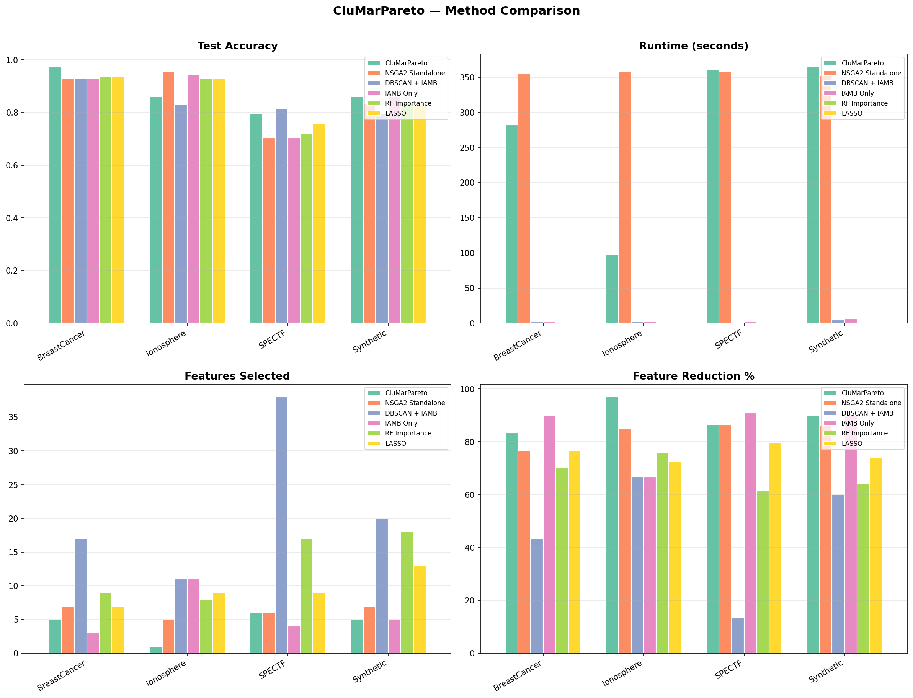
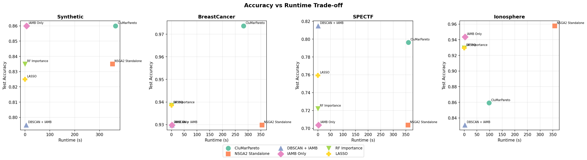

# CluMarPareto
### Cluster-Guided Markov Blanket Assisted Multi-Objective Feature Selection


CluMarPareto is a hierarchical feature selection framework that structures the search space before multi-objective optimization. Instead of running NSGA-II directly on the full feature space — which is computationally expensive and poorly structured — it first reduces the space through two principled filtering stages before passing a compact, causally-sufficient subset to the optimizer.

## Motivation

Applying NSGA-II directly to a high-dimensional feature space suffers from:
- Large, poorly-structured search space → slow convergence
- No structural grouping of correlated features → redundant evaluations
- No causal filtering → noise features included in optimization

CluMarPareto addresses all three by clustering correlated features, extracting causally sufficient subsets via Markov Blanket discovery, and then running NSGA-II only on the survivors.

---
## Approach 1

### Overview


```
Raw Features
     ↓
Stage 1 — DBSCAN Clustering
     Group correlated features · Isolate structural outliers
     ↓
Stage 2 — IAMB (Markov Blanket Discovery)
     Causal filtering within each cluster
     ↓
Stage 3 — NSGA-II
     Multi-objective optimization on reduced space
     ↓
Knee-point solution (complexity-penalised accuracy)
```

---

## Pipeline Details

### Stage 1 — DBSCAN Clustering
Features are clustered using DBSCAN on a correlation-based distance matrix `D = 1 - |corr(Xi, Xj)|`. Structurally unique features (noise points) bypass all filtering and pass directly to NSGA-II.

**Auto-derived hyperparameters:**
| Parameter | Formula | Justification |
|---|---|---|
| `eps` | Elbow of k-NN distance curve | Schubert et al. (2017) |
| `min_samples` | `max(2, ⌊log(p)⌋)` | Sublinear scaling with features |

### Stage 2 — IAMB (Incremental Association Markov Blanket)
IAMB (Tsamardinos et al., 2003) discovers the Markov Blanket of the target variable within each cluster independently. It uses a forward phase to greedily add features with high conditional mutual information with the target, followed by a backward phase to remove features that become conditionally independent given the remaining Markov Blanket members.

**Auto-derived hyperparameters:**
| Parameter | Formula | Justification |
|---|---|---|
| `alpha` | `0.05 / p` (Bonferroni) | Dunn (1961) |
| `n_bins` | `max(5, min(20, ⌊n^(1/3)⌋))` | Scott (1979) cube-root rule |

### Stage 3 — NSGA-II
Multi-objective optimization over two objectives: minimise feature count, maximise classification accuracy (5-fold CV with Decision Tree). The final solution is selected from the Pareto front using complexity-penalised accuracy:

```
score = accuracy - (n_selected / n_samples)
```

**Auto-derived hyperparameters:**
| Parameter | Formula | Justification |
|---|---|---|
| `population_size` | `min(200, max(50, 10 × p'))` | Goldberg (1989) |
| `n_generations` | `min(200, max(50, N/2))` | Schema theorem |
| `mutation_rate` | `1 / p'` | Standard GA practice |
| `crossover_rate` | Fixed 0.8 | De Jong (1975), Deb et al. (2002) |

*p = original features, p' = features after IAMB, n = training samples, N = population size*

---

## Benchmark Results

Evaluated on 4 datasets against 5 baseline methods using a held-out test set (80/20 split). Classifier: Decision Tree (max_depth=5).

### Datasets

| Dataset | Samples | Features | Source |
|---|---|---|---|
| Synthetic | 800 | 50 | sklearn (10 informative, 20 redundant) |
| Breast Cancer Wisconsin | 455 | 30 | UCI (ID: 17) |
| SPECTF Heart | 170 | 44 | UCI (ID: 96) |
| Ionosphere | 280 | 33 | UCI (ID: 52) |

### Test Accuracy

| Method | Synthetic | BreastCancer | SPECTF | Ionosphere |
|---|---|---|---|---|
| **CluMarPareto** | **0.860** | **0.974** | **0.796** | 0.859 |
| NSGA2 Standalone | 0.835 | 0.930 | 0.704 | **0.958** |
| DBSCAN + IAMB | 0.795 | 0.930 | 0.815 | 0.831 |
| IAMB Only | 0.860 | 0.930 | 0.704 | 0.944 |
| RF Importance | 0.835 | 0.939 | 0.722 | 0.930 |
| LASSO | 0.825 | 0.939 | 0.759 | 0.930 |

### Features Selected

| Method | Synthetic | BreastCancer | SPECTF | Ionosphere |
|---|---|---|---|---|
| **CluMarPareto** | **5** | **5** | **6** | **1** |
| NSGA2 Standalone | 7 | 7 | 6 | 5 |
| DBSCAN + IAMB | 20 | 17 | 38 | 11 |
| IAMB Only | 5 | 3 | 4 | 11 |
| RF Importance | 18 | 9 | 17 | 8 |
| LASSO | 13 | 7 | 9 | 9 |

### Feature Reduction %

| Method | Synthetic | BreastCancer | SPECTF | Ionosphere |
|---|---|---|---|---|
| **CluMarPareto** | **90%** | **83%** | **86%** | **97%** |
| NSGA2 Standalone | 86% | 77% | 86% | 85% |
| DBSCAN + IAMB | 60% | 43% | 14% | 67% |
| IAMB Only | 90% | 90% | 91% | 67% |
| RF Importance | 64% | 70% | 61% | 76% |
| LASSO | 74% | 77% | 80% | 73% |

### Runtime (seconds)

| Method | Synthetic | BreastCancer | SPECTF | Ionosphere |
|---|---|---|---|---|
| **CluMarPareto** | 365 | 282 | 360 | **98** |
| NSGA2 Standalone | 352 | 355 | 359 | 358 |
| DBSCAN + IAMB | 4 | 2 | 1 | 2 |
| IAMB Only | 6 | 2 | 2 | 3 |
| RF Importance | 0.1 | 0.1 | 0.1 | 0.1 |
| LASSO | 0.01 | 0.003 | 0.002 | 0.001 |

### Average Rank Across All Datasets (lower = better)

| Method | Accuracy ↑ | Runtime ↓ | Features ↓ | Overall |
|---|---|---|---|---|
| **CluMarPareto** | **2.4** | 5.5 | **1.8** | **3.2** |
| LASSO | 3.5 | **1.0** | 3.9 | 2.8 |
| IAMB Only | 3.5 | 4.0 | 2.3 | 3.3 |
| RF Importance | 3.4 | 2.0 | 4.5 | 3.3 |
| NSGA2 Standalone | 3.8 | 5.5 | 2.8 | 4.0 |
| DBSCAN + IAMB | 4.5 | 3.0 | 5.9 | 4.5 |

### Visualizations

**Method Comparison across all metrics:**



**Accuracy vs Runtime trade-off:**



---

## Key Observations

**1. Best accuracy with fewest features.** CluMarPareto ranks 1st in feature reduction (avg rank 1.8) and 1st in overall accuracy (avg rank 2.4) across all datasets — demonstrating that aggressive pre-filtering does not sacrifice predictive quality.

**2. CluMarPareto outperforms NSGA-II standalone on accuracy.** On 3 of 4 datasets CluMarPareto achieves higher test accuracy than NSGA-II on the full feature space, while selecting equal or fewer features. This validates the claim that structured pre-filtering improves solution quality.

**3. Runtime advantage on structured datasets.** On Ionosphere (33 features, strong correlation structure), CluMarPareto converges in 98s vs 358s for NSGA-II standalone — a 3.6× speedup. The speedup is more pronounced when DBSCAN identifies meaningful clusters, reducing the NSGA-II search space significantly.

---


## References

- Deb, K., Pratap, A., Agarwal, S., & Meyarivan, T. (2002). A fast and elitist multiobjective genetic algorithm: NSGA-II. *IEEE Transactions on Evolutionary Computation*, 6(2), 182–197.
- Aliferis, C. F., Tsamardinos, I., & Statnikov, A. (2003). HITON: A novel Markov Blanket algorithm for optimal variable selection. *AMIA Annual Symposium Proceedings*, 21–25.
- Tsamardinos, I., Aliferis, C. F., & Statnikov, A. (2003). Algorithms for large scale Markov blanket discovery. *FLAIRS 2003*.
- Schubert, E., Sander, J., Ester, M., Kriegel, H.-P., & Xu, X. (2017). DBSCAN revisited, revisited. *ACM Transactions on Database Systems*, 42(3), 1–21.
- Dunn, O. J. (1961). Multiple comparisons among means. *Journal of the American Statistical Association*, 56(293), 52–64.
- Scott, D. W. (1979). On optimal and data-based histograms. *Biometrika*, 66(3), 605–610.
- Goldberg, D. E. (1989). *Genetic Algorithms in Search, Optimization and Machine Learning*. Addison-Wesley.
- Akaike, H. (1974). A new look at the statistical model identification. *IEEE Transactions on Automatic Control*, 19(6), 716–723.